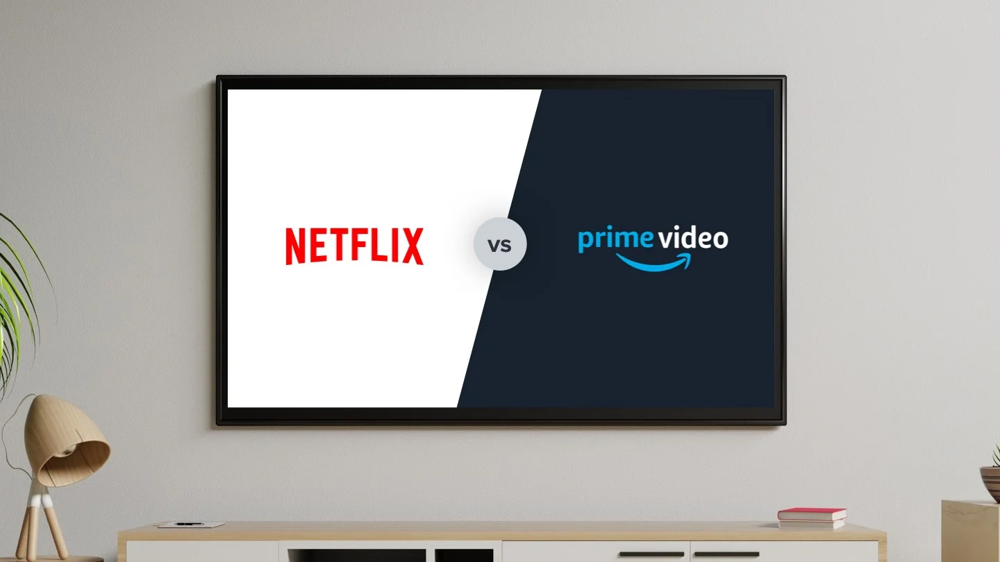

# Project 2: Amazon & Netflix Film & TV Show Titles
DAV Module 13 - Project 2 Group Challenge: ETL

## Background 

<!-- 

√ Proposal cites at least two sources of data
√ Proposal includes the type of final production database to load the data into (relational or non-relational)
√ Gives relevant and succinct description of findings (2–3 sentences)

-->

The aim of our project is to...
<!-- uncover patterns in credit card fraud. We’ll examine relationships between transaction types and location, purchase prices and times of day, purchase trends over the course of a year, and other related relationships derived from the data. -->
1. compare the number of released titles each year
2. compare the number of released categories each year
3. compare the most active directors
4. compare the number country releases per year

* Using relational db - pgAdmin

## Sources:

We had 2 csv files from [Kaggle Datasets](https://www.kaggle.com/datasets/):
* [Netflix Shows](https://www.kaggle.com/datasets/shivamb/netflix-shows)
* [Amazon Prime Movies & TV Shows](https://www.kaggle.com/datasets/shivamb/amazon-prime-movies-and-tv-shows)

<!-- 

√ Extract: indicates the original data sources and how the data were formatted at a professional level
√ Transform: explains what data clearing or transformation was required at a professional level
√ Load: explains the final database, tables/collections, and why the topic was chosen at a professional level 

-->

## Extraction

Insert head snippets of original csv dfs:

* Netflix original df with 12 columns

* Amazon original df with 12 columns

## Transform

* insert head snippets of shrunken csv dfs (second df)

For both dfs:
1. import csvs into ipynb to clean
2. renamed column name
3. extract columns required
4. convert string into list strings
5. explode rows into multiples rows for category column

* insert screenshots of cleaned df and graphs

## Load

* final db load, used pgAdmin relational db
* created Project2-db
* created 2 tables - amazon, netflix
    * with `id serial as primary key` to link the 2 tables together
* loaded data from Pandas to sql

### SQL Query

* SQL queries
* insert screenshots of cleaned df and graphs

### Pandas & Matplotlib
* make some diagrams
* insert screenshots of cleaned df and graphs

<!--

√ Successfully uploaded to GitHub; demonstrating professional quality of presentation
√ GitHub repository is free of unnecessary files and folders and has an appropriate .gitignore in use
√ The README is customized to a professional level

 -->

[Project 2 Rubric](https://docs.google.com/document/d/1-sJWb5pq3OeFBPAZ_IDXR9LJvY7PoCUickgjTsPVnWo/edit)

- - -

 Team - Group 4 (5)

* Anderson Safo (SAFO99)
* Cheila Bergamini
* Grace Cheuk (gw-sc)
* Lionnel Tembu (Tembspapi)
* Navindeep Bains (navinbains)
